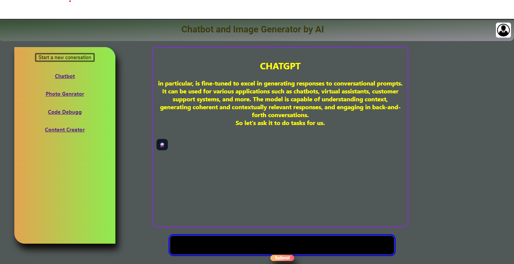
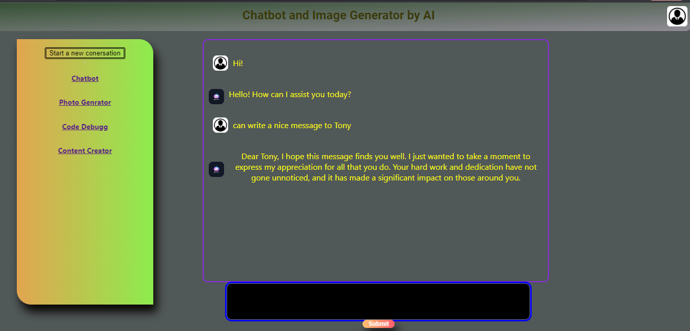
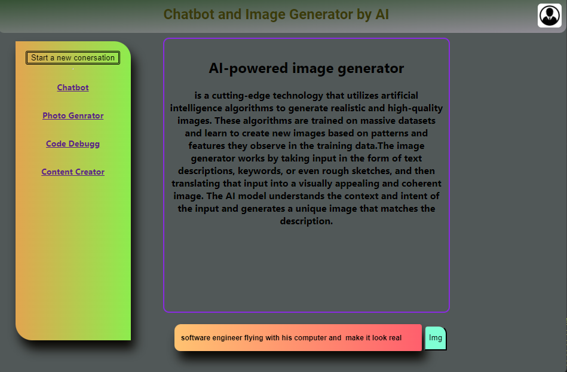
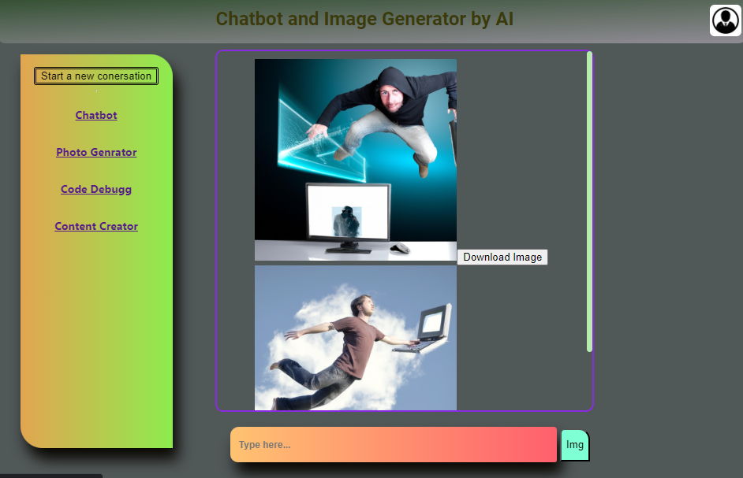

# Chatbot and Image Generator

This website is a project that utilizes the OpenAI API to create a chatbot and generate photos. It is built using React and hosted on Render.com.

Please note that the content generation and code debugging are still in progress. However, the basic functionality of the chatbot and image generation is available.

## Website URL

The website is hosted on Render.com. You can access it using the following URL:

[https://chatbot-img-generate.onrender.com/chatbot](https://chatbot-img-generate.onrender.com/chatbot)

Note that due to the free version of hosting being used, the website may load slowly.

## Screenshots

The above screenshots showcase the chatbot and image generator functionalities.

## API Key

The website relies on the OpenAI API to power its chatbot and image generation features. An API key is required to access the OpenAI API. If the provided API key is not working, please contact me to update it.

## Development

To contribute to the development of this website, follow these steps:

 Clone the repository:
    https://github.com/BBricha/api-project-modII
